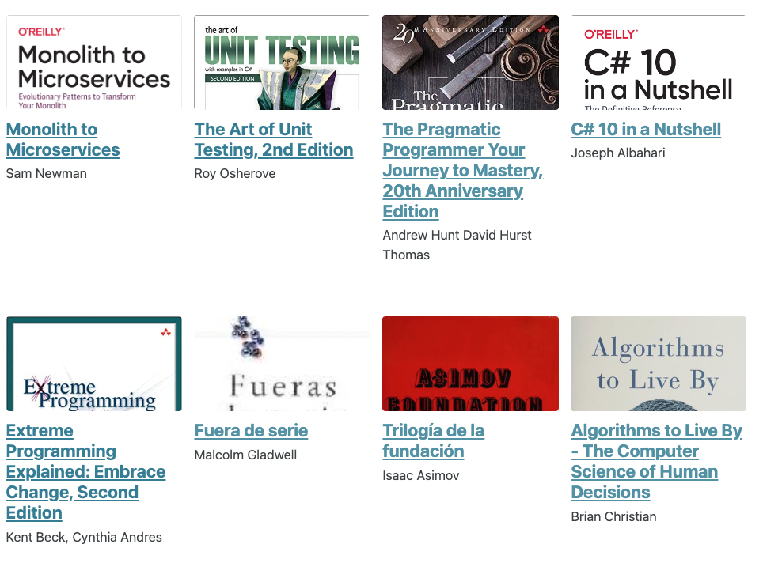

# Kindle and O'Reilly highlights to Markdown



Node app to parse your Kindle (My Clippings.txt) or O'Reilly highlights and create a Markdown file per book grouping the quotes. It is intended to be used with Jekyll. It links to the book cover image too.
[Example of the output](https://juan.pallares.me/books/).

The quotes are ordered by date descending. The books have the date of the most recent quote assigned.

The script will attempt to get a cover from [openlibrary.org](https://openlibrary.org/).

## How to install

1. Install Node I you haven't
2. Clone and move to folder
3. `npm i`

### How to use for Kindle MyClippings

1. `node app kindle "some\path\My Clippings.txt" "output\path"`

### How to use for O'Reilly Highlights

1. `node app oreilly "some\path\oreilly-annotations.csv" "output\path"`

It works also without the last argument using `output` as default output folder.
It works also without the last two arguments but expects to find the source file in the root folder.

## Known issues

O'Reilly highlights do not include the author, it has to be manually added.

## Jekyll site usage

1. Create a \_books folder in your jekyll repo and move there all the generated md files.
1. Add the collection to your `_config.yml`:

```yml
include:
  - _books

...

collections:
  books:
    output: true
    permalink: /:collection/:path/

...

defaults:
  ...
  # _books
  - scope:
      path: ""
      type: books
    values:
      layout: single
      author_profile: true
      share: true
      comments: true
```

3. Add a navigation link in the top bar editing `navigation.yml` inside `_data` folder:

```yml
main:
  - title: cv
    url: /cv/
  - title: books
    url: /books/
```

4. Finally create a page that will have the links to all the books. I created `books.md` and put it inside `_pages` folder:

```yml
---
title: Books
layout: collection
permalink: /books/
collection: books
entries_layout: grid
classes: wide
sort_order: reverse
---
```

## I want just the JSON

In case you want another type of output, there is a middle step (parse) were a simple array of objects (books) is created with the following structure:

```
[
    {
      title: 'Scrum And Xp From The Trenches',
      date: '2015-02-21',
      author: 'Henrik Kniberg',
      quotes: [
          {
            date: '2015-02-21',
            chapter: 'Chapter name'
            quote: 'Pair programming does improve code quality....'
        },
        {
            date: '2015-02-19',
            chapter: 'Chapter name'
            quote: 'anotherquote....'
        }
      ]
    },
    {
      title: 'Another book title',
      date: '2014-04-21',
      author: 'Fancy Name',
      quotes: [
          {
            date: '2017-02-21',
            chapter: 'Chapter name'
            quote: 'interensting quote....'
        },
        {
            date: '2019-02-19',
            chapter: 'Chapter name'
            quote: 'even more interesting quote....'
        }
      ]
    }
]
```
